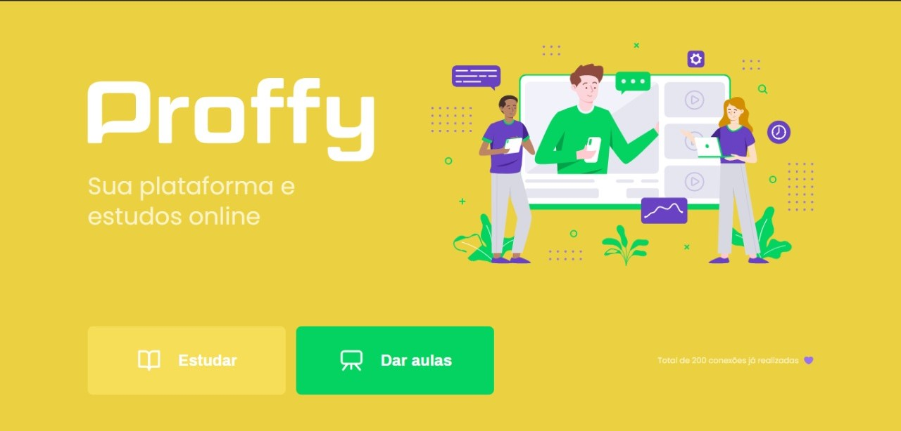
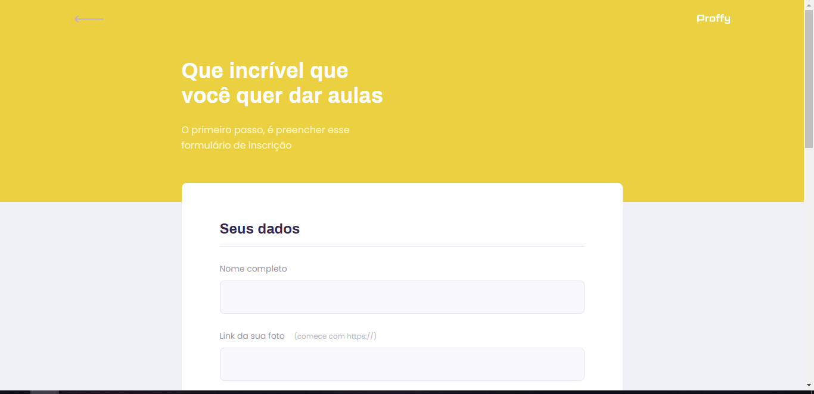
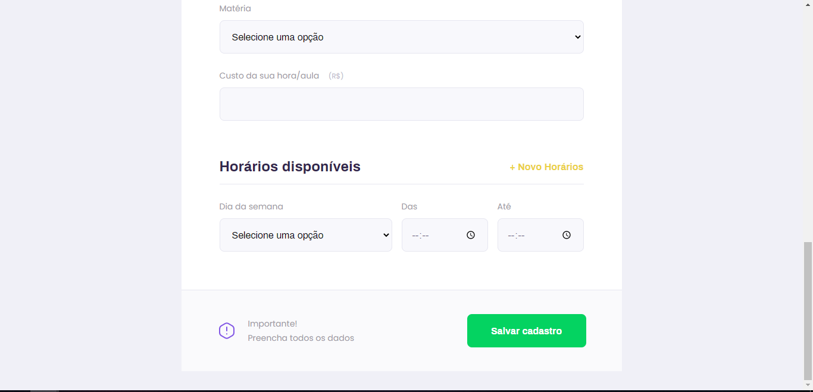
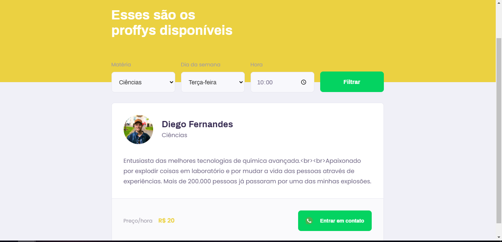

<p align="center">
  
</p>

<div align="center">

<space> <space><space> <space><space> <space>

</div>

## 📋 Índice

- [Sobre](#-Sobre)
- [Tecnologias utilizadas](#-Tecnologias-utilizadas)
- [Como executar o projeto](#-Como-executar-o-projeto)
- [Preview](#-Preview)

---

## 🖥 Preview 

<p align="center">
  
  
  
  
</p>

---

## 📖 Sobre 

Este é um projeto desenvolvido durante a **[Next Level Week](https://nextlevelweek.com/)**, realizada pela **[@Rocketseat](https://github.com/Rocketseat)** durante os dias 3 a 9 de Agosto de 2020.

Projeto que conecta quem quer aprender com quem quer ensinar, projeto full-stack, na trilha Discovery (iniciante) com o instrutor Mayk Brito. 

--- 

## 🚀 Tecnologias utilizadas

O projeto está desenvolvido utilizando as seguintes tecnologias:

- HTML
- CSS
- JavaScript
- Node.js 
- Nunjucks 
- SQLite 

--- 

## ⌨ Como executar o projeto

```bash
# Clonar o repositório
git clone https://github.com/LarissaGuarana/PROFFY_NLW

# Entrar no diretório
cd PROFFY_NLW

# Executar o servidor
npm run dev
```

Feito isso, abra o seu navegador e acesse `http://localhost:5500/`

---
